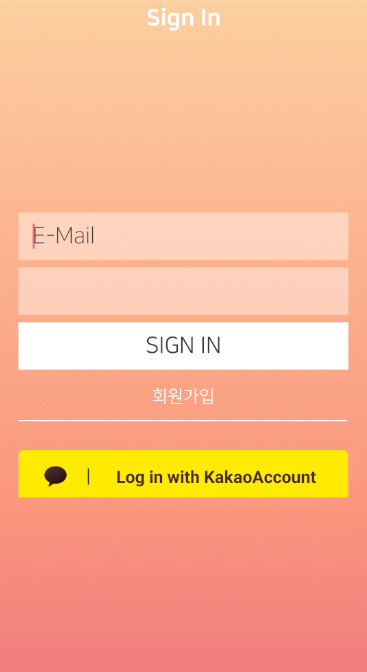
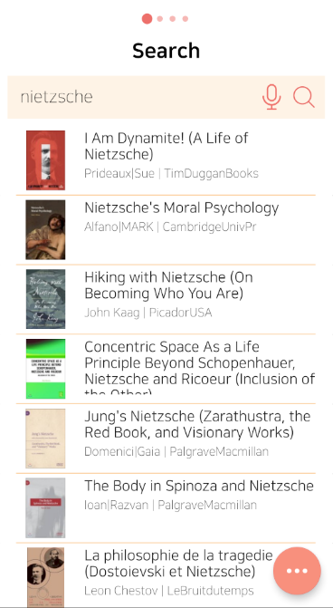
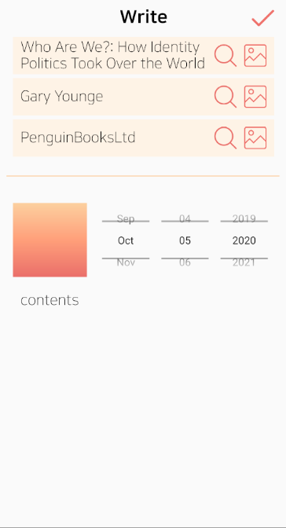

# 책깔:피
기술스택 Node.js, MySQL, kotlin, javascript, python, Flask

[play strore](https://play.google.com/store/apps/details?id=com.b1n.mybook)

## 개요
- 프로젝트 명: 책깔:피
- 일정 2019.06(프론트), 2020.10(백엔드)
- 목적: 책은 읽고 난 후에 독자로 하여금 다양한 사고를 유발한다. 이렇게 생성된 것들은 단지, 머릿속에 두는 것으로 멈추지 않고 글로 써내려 가거나, 다른 사람과 생각을 공유 하는 활동으로 자연스럽게 이어질 것이다.   블로그, 독서 모임, SNS 등 쉽게 접할 수 있는 매체에서 자신의 생각을 공유하는 것은 이전부터 자주 있었던 일이다. 이러한 활동은 자신과 비슷한 취향, 생각 등을 가지고 있는 사람과의 네트워크 형성을 통해 효과를 극대화할 수 있을 것이라 생각했다.   하지만, 기존 활동(SNS, 블로그, 독서 모임 등)은 사람과의 특정 네트워크 형성에 큰 도움을 주지 못 한다. 기존 활동에는 분명 한계점이 있었다. 무차별적으로 쌓아지는 정보 중 사용자가 원하는 정보를 찾는 것이 힘들듯. 예를 들어, 자신과 비슷한 책을 읽은 사람끼리 보이지 않는 그룹을 형성하고, 책을 추천하며, 자신의 생각을 올리고 그와 공감하는 사람들끼리 의견을 주고받는 활동은 기존 활동의 연장선으로 독서 활동을 효과적으로 도울 수 있을 것이다.
- 사용 기술
    - DB: MySQL
    - Framework/flatform: Nodejs
    - Programming Language: Javascript, kotlin
    - AWS S3, Lightsail, EC2를 이용하여 이미지 업로드와 serverless node 구현.
    - 현재 Keras 기반 Collaborative Filtering 시스템 구현 후 Flask를 이용하여 간단하게 Learning Server 작성 중에 있습니다.

자세한 프로젝트 제안은 [여기](https://github.com/lkic1625/bookmark-back/tree/master/project/proposal.pdf)를 확인해주세요

안드로이드 프론트 코드는 [여기](https://github.com/lkic1625/bookmark-front)

로그인 탭입니다.

글 작성 탭입니다.

책 검색 탭입니다.
